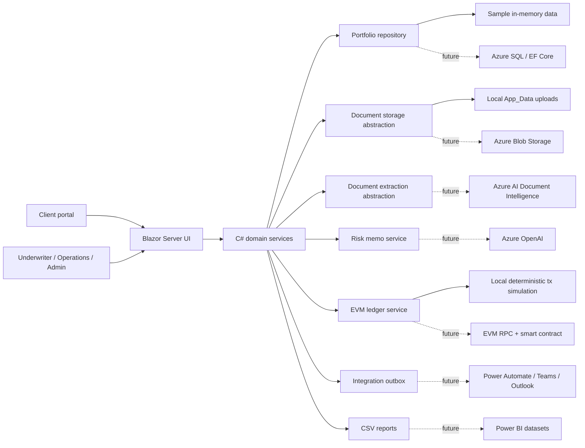
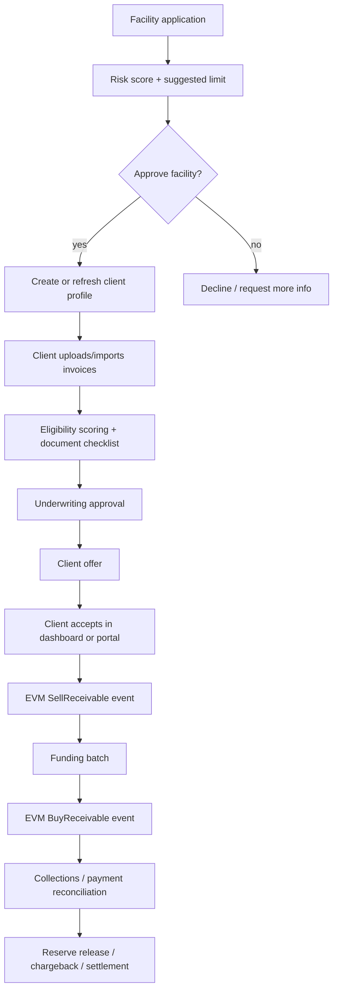
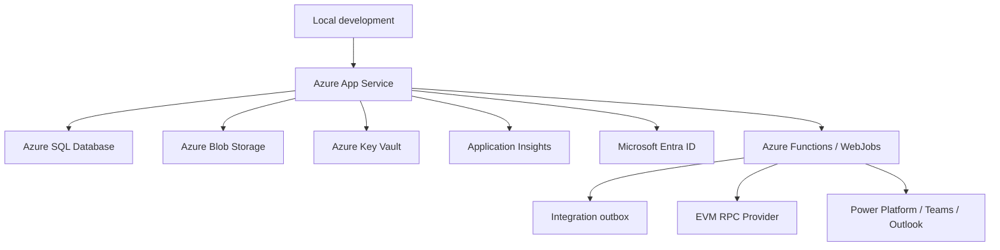

# FactorLab System Architecture

## Purpose

FactorLab is a Microsoft-stack invoice factoring platform for onboarding clients, underwriting receivables, issuing offers, funding invoices, collecting payments, and recording every receivable buy/sell action on an EVM-compatible blockchain ledger.

The current implementation is intentionally local-first: services run in memory with sample data, but the boundaries are shaped so they can be replaced by Azure SQL, Blob Storage, Entra ID, Azure AI, Power BI, and a real EVM RPC/smart-contract adapter without rewriting the workflow.

## Architecture Overview

## Runtime Components

- Web application: ASP.NET Core / Blazor Server in `src/FactorLab.Web`.
- UI pages: main workspace in `Pages/Index.razor`, client offer portal in `Pages/Portal.razor`.
- Domain model: C# classes under `Domain`.
- Business services: calculator, onboarding, offers, funding, borrowing base, collections, disputes, confirmations, fraud, reports, templates, EVM ledger under `Services`.
- Persistence contract: `IPortfolioRepository`.
- Current data source: `SamplePortfolioService`.
- Future data source: `FactorLabDbContext` plus `SqlServerSchema.sql`.
- API surface: minimal endpoints in `Program.cs`.
- Static prototype: `index.html`, `script.js`, `styles.css`.

## Core Business Flow

## EVM Blockchain Rule

Every receivable buy or sell action is recorded in `EvmTradeEvents`.

Current behavior:

- Client offer acceptance records `SellReceivable`.
- Client portal acceptance also records `SellReceivable`.
- Funding batch creation records `BuyReceivable`.
- Each event stores chain id, network, contract address, invoice, counterparty, amount, currency, payload hash, transaction hash, submission timestamp, confirmation timestamp, actor, and status.
- The current `LocalEvmLedgerService` calls an `IEvmTradeSubmitter`.
- `SimulatedEvmTradeSubmitter` creates deterministic hashes locally so the product workflow is testable without an RPC key or wallet.
- `EvmRpcTradeSubmitter` is the production adapter boundary selected by `Evm:Mode = Rpc`.
- The Solidity contract skeleton lives in `contracts/FactorLabReceivables.sol`.

Future production adapter:

- Keep `LocalEvmLedgerService` as the business ledger orchestration layer.
- Replace `SimulatedEvmTradeSubmitter` with a Web3/EVM submitter implementation.
- Sign transactions with a controlled treasury/operator wallet.
- Submit to the configured RPC endpoint.
- Persist the real tx hash, block number, gas metadata, and confirmation status.
- Keep the current `IEvmTradeSubmitter` and `IEvmLedgerService` interfaces so the rest of the app does not change.

## Domain Modules

- Facility onboarding: captures requested limits, turnover, debtor count, trading history, risk score, suggested limit, review, approval, decline.
- Client and debtor profiles: facility limits, KYC status, credit limits, payment behavior, dilution, buy/watch/no-buy.
- Invoice book: editable receivables, CSV import, funding stage, debtor rating, concentration, status.
- Eligibility engine: score, blockers, warnings, risk policy thresholds.
- Document workflow: checklist, upload metadata, document readiness, extraction abstraction.
- Underwriting: approvals, conditional approvals, declines, overrides, audit trail.
- Offer workflow: funding offer creation, send, accept, decline, portal token, dedicated client portal.
- Funding operations: approved invoice batching, advances, fees, reserve, net cash.
- Ledger and borrowing base: derived cash/reserve movements and availability calculations.
- Collections: aging, reminders, calls, promise-to-pay, paid status, reserve release, chargeback.
- Payment reconciliation: CSV remittance matching, partial/unmatched tracking.
- Disputes and dilution: open, investigate, resolve, credit note, chargeback.
- Debtor confirmations: send, confirm, dispute, update document readiness.
- Fraud signals: duplicates, lookalikes, unknown debtors, missing confirmations, adverse statuses, overrides.
- Reporting: CSV exports for portfolio, exposure, applications, EVM ledger, collections, underwriting, ledger, borrowing base, payments, disputes, confirmations, fraud.
- Integration outbox: local event queue for Teams, Outlook, Power Automate, Power BI, Azure AI, Dynamics 365, and EVM RPC handoff.

## API Surface

Current internal API groups:

- Portfolio: `/api/portfolio/summary`
- Reports: `/api/reports/{kind}`
- Facility applications: `/api/facility-applications`
- Client offers: `/api/client-offers`
- EVM ledger: `/api/evm/trades`
- Invoices: `/api/invoices/import`
- Funding: `/api/funding-batches/create`
- Ledger: `/api/ledger`
- Borrowing base: `/api/borrowing-base`
- Payments: `/api/payments/reconcile`
- Disputes: `/api/disputes/...`
- Debtor confirmations: `/api/debtor-confirmations/...`
- Fraud: `/api/fraud-signals`
- Templates: `/api/templates/{kind}/{invoiceNumber}`
- Integrations: `/api/integration-events`
- Covenants: `/api/covenants`
- Action center: `/api/action-items`

## Persistence Architecture

Current mode:

- `SamplePortfolioService` stores in-memory lists for fast product iteration.
- `Persistence:Mode = Sample` is the default runtime.
- Uploads use local app data.
- EVM transactions are deterministic local records.

Production target:

- Azure SQL Database for operational data.
- EF Core via `FactorLabDbContext`.
- `Persistence:Mode = SqlServer` activates `SqlPortfolioRepository` when the app is built with `EnableEfCore=true`.
- `/api/persistence/status` reports the active provider.
- `/api/persistence/save` flushes tracked SQL repository changes and newly added workflow records.
- Azure Blob Storage for uploaded documents.
- Azure Key Vault for secrets, RPC keys, connection strings, wallet references.
- Application Insights for diagnostics and workflow telemetry.

Key SQL entities:

- Clients, debtors, invoices, document requirements.
- Facility applications.
- Underwriting decisions, audit events.
- Funding batches, ledger entries, borrowing base snapshots.
- EVM trade events.
- Collections, payment matches, disputes, confirmations.
- Integration events, templates, covenant snapshots, fraud snapshots.

## Security And Roles

Current role model:

- Client: submits invoices, accepts offers, uses portal.
- Underwriter: reviews risk, approves applications and invoices, creates offers.
- Operations: funds batches, reconciles payments, manages collections.
- Admin: full access.

Production security target:

- Microsoft Entra ID for staff.
- Entra External ID or B2B/B2C flow for clients.
- Role-based policies around facility approval, funding, collections, and EVM transaction submission.
- Smart-contract write actions limited to trusted operational service identities or wallet custody.
- Audit events and EVM records retained as immutable business evidence.

## Integration Architecture

The integration outbox is the boundary for external systems. Today it is local and visible in the UI; later it can be drained by workers.

Target integrations:

- Microsoft Teams: daily queue, exceptions, confirmations, EVM failures.
- Outlook: debtor confirmations, reminders, client offer sends.
- Power Automate: invoice import, funding batch, payment reconciliation.
- Dynamics 365: client onboarding and offer lifecycle.
- Power BI: reporting datasets.
- Azure AI Document Intelligence: invoice/PO/proof-of-delivery extraction.
- Azure OpenAI: risk memos and underwriting summaries.
- EVM RPC: transaction submission and confirmation tracking.

## Deployment Shape

Recommended first production deployment:

1. Azure App Service for the Blazor Server app.
2. Azure SQL Database with EF Core enabled.
3. Azure Blob Storage for documents.
4. Entra authentication and role policies.
5. Key Vault-backed configuration.
6. Background worker for integration outbox and EVM confirmations.
7. Application Insights monitoring.

## Implementation Notes

- The app is deliberately service-oriented inside one project, not split into microservices yet.
- All replaceable infrastructure has an interface first: document storage, document extraction, risk memo, reports, integration outbox, EVM ledger.
- EVM write behavior is currently simulated but structurally placed on the exact business actions that must be on-chain.
- The next architecture step is a real EVM adapter plus background confirmation worker.
