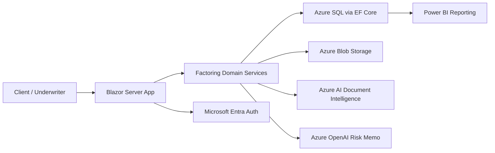

# FactorLab Microsoft Stack

## Direction

The static prototype remains the product sketch. The production app moves to a Microsoft-native stack:

- Web app: ASP.NET Core / Blazor Server
- Domain and business logic: C#
- Data access: Entity Framework Core
- Database: Azure SQL Database
- Auth: Microsoft Entra ID / Entra External ID
- File storage: Azure Blob Storage
- Document extraction: Azure AI Document Intelligence
- AI risk memos: Azure OpenAI
- Reporting: Power BI Embedded or exportable Power BI datasets
- Hosting: Azure App Service first, Azure Container Apps later if needed
- Background work: Azure Functions or hosted workers
- Secrets/config: Azure Key Vault
- Observability: Application Insights

## First Product Architecture

## Core Modules

- Receivables workspace
- Pricing and eligibility engine
- Funding request workflow
- Document checklist
- Client profiles
- Debtor profiles
- Underwriting desk
- Collections pipeline
- Payments and reserve release
- Reports and exports

## Development Order

1. Blazor app shell and domain model.
2. Factoring calculator and eligibility reasons in C#.
3. Funding request workflow.
4. Document checklist and file metadata model. Completed in first UI pass.
5. Client and debtor profiles with credit-limit exposure. Completed in first UI pass.
6. EF Core persistence with SQL Server. SQL schema and conditional EF setup added; package restore requires NuGet connectivity.
7. Authentication and roles. Auth-ready role model and role-based UI actions added; Entra integration comes next.
8. Azure Blob upload flow. Local storage abstraction and upload UI added; Azure Blob implementation can replace `LocalDocumentStorageService`.
9. Underwriting queue and audit log. Completed in first UI pass.
10. Collections pipeline. Completed in first UI pass.
11. Azure AI document extraction and AI risk memo. Local service interfaces and working risk memo UI added; Azure implementations can replace `LocalRiskMemoService` and `LocalDocumentExtractionService`.
12. Reports and exports. CSV reporting layer added for portfolio, exposure, collections and underwriting datasets; Power BI can reuse these report shapes.
13. Action center. Local priority queue added for document gaps, KYC refresh, debtor watch/no-buy, underwriting blockers and collections follow-up.
14. Risk policy configuration. Eligibility thresholds moved into editable policy settings for score, tenor, concentration, utilization, dilution and slow-pay rules.
15. Integration outbox. Local event queue added for Teams, Outlook, Power Automate, Power BI and Azure AI Document Intelligence handoff.
16. Internal API surface. Minimal endpoints added for portfolio summary, report CSVs, action queue and integration events.
17. Template center. Local generation added for funding offers, notices of assignment, debtor confirmations and collection reminders; Word/Outlook integrations can reuse the same service.
18. Portfolio covenant monitoring. Automated checks added for document readiness, facility utilization, debtor credit limits, concentration, KYC and collections exceptions.
19. Persistence schema expansion. SQL Server schema extended for terms/risk policy, action items, integration events, generated templates and covenant snapshots.
20. Bulk invoice import. Blazor CSV upload and API import endpoint added with add/update behavior, audit trail and integration event.
21. Funding ledger. Derived ledger added for advances, fees, reserve held, payments, reserve releases and chargebacks, with API and SQL schema coverage.
22. Borrowing base availability. Client-level availability added after eligibility, concentration caps, debtor limits and existing advances, with API, CSV export and SQL snapshot coverage.
23. Funding batch operations. Approved invoices can be converted to funding batches with net cash, reserve and fee calculations, API endpoint, SQL schema and integration event.
24. Payment reconciliation. Remittance CSV import added for matched, partial and unmatched payments, with reserve release, collections activity, API endpoint, SQL schema and payments CSV report.
25. Dispute and dilution management. Dispute cases added for invoice disputes, credit notes, resolution and chargeback paths, with UI, API, SQL schema and CSV report.
26. Debtor confirmation workflow. Structured confirmation requests added with sent/confirmed/disputed states, document readiness updates, dispute escalation, API endpoints, SQL schema and CSV report.
27. Fraud and anomaly detection. Local signal engine added for duplicate/lookalike invoices, unknown debtors, missing confirmations, adverse statuses and manual overrides, with UI, API, SQL snapshot schema and CSV report.

## Roles

- Client: uploads invoices, submits funding requests, tracks status.
- Underwriter: reviews risk, approves/declines, sets conditions.
- Operations: funds invoices, tracks collections, releases reserve.
- Admin: manages terms, users, limits, templates and integrations.

## Domain Objects

- Company
- UserAccount
- Debtor
- Invoice
- FundingRequest
- FundingRequestInvoice
- FactoringTerms
- EligibilityDecision
- DocumentRequirement
- UploadedDocument
- UnderwritingDecision
- CollectionActivity
- PaymentReceipt
- ReserveRelease
- AuditEvent

## Near-Term Rule

Keep the first .NET version simple and useful before adding Azure dependencies. The app should work locally with in-memory/sample data, then move to SQL Server once the workflow feels right.
